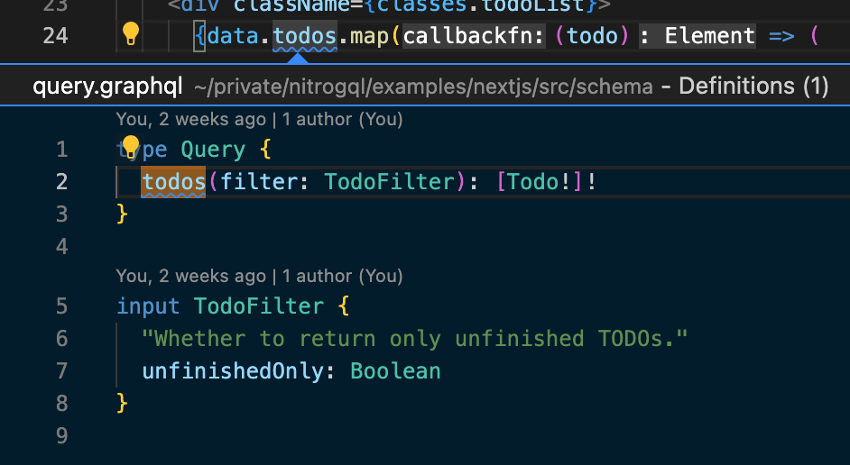

**GraphQL + TypeScript. Done right.**

**[Documentation](https://nitrogql.vercel.app/)**

# nitrogql

**nitrogql** is a toolchain for using GraphQL in TypeScript projects. Main features include:

## Type generation with sourcemap support.

nitrogql generates TypeScript types for your GraphQL schema and queries. It also generates a sourcemap file that maps the generated types to the original GraphQL schema and queries. With sourcemaps, you will never see generated code in your IDE, and you will always be able to jump to the original source code.



## Static check for GraphQL code.

nitrogql can check your GraphQL code statically and guard you from any runtime errors caused by type mismatch.


## And more planned...

Type generation currently only supports client side code (usage with GraphQL clients like Apollo Client). Support for writing server side code (resolvers) is planned.

## Installation

Install the nitrogql CLI with npm:

```sh
npm install --save-dev @nitrogql/cli
```

The CLI will enable you to check GraphQL files and generate types. Read more about the CLI in the [CLI documentation](https://nitrogql.vercel.app/cli).

To use GraphQL in your front-end project, you will also need to install appropriate loader.

For webpack-based projects:

```sh
npm install --save-dev @nitrogql/graphql-loader
```

For Rollup-based projects:

```sh
npm install --save-dev @nitrogql/rollup-plugin
```